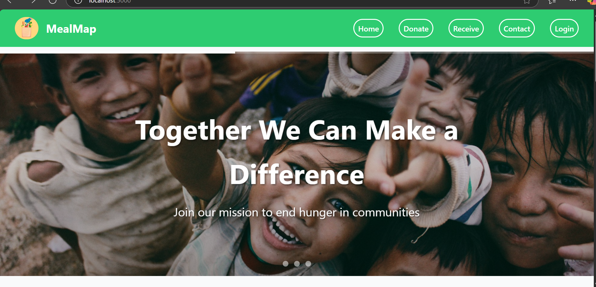
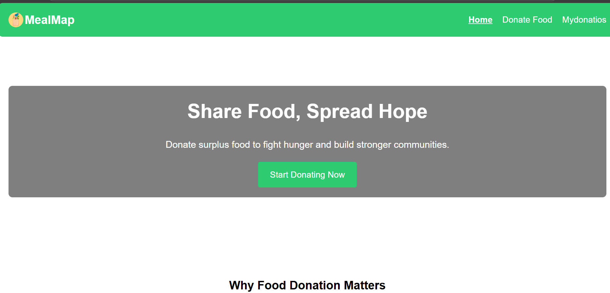

# MealMap

🍽️ Project Title: 
MealMap

🌐 Selected Domain: 
 Food Tech (web Development)

🧠 Problem Statement / Use Case
Create a smart platform to reduce food waste by connecting food donors (restaurants, households, etc.) with nearby NGOs or shelters in need of food, using geolocation and an intuitive user interface.

📝 Abstract / Problem Description
Every day, vast amounts of edible food are discarded, while millions go hungry. Meal Map aims to tackle this issue by providing a location-aware platform where food donors can easily register excess food and have it picked up by nearby NGOs or shelters. The app ensures that surplus food is rescued and redirected to those in need, leveraging modern web technologies and maps to create a smooth and efficient donation flow.

🧰 Tech Stack Used
Frontend: HTML, CSS and Javascript

Backend: Express.js, Node.js

Database: MongoDB

Maps: Google Maps API or Leaflet.js

Tools: GitHub, VS Code

📖 Project Explanation
User Roles: Donors, Receiver, Admin

Donation Flow: Donor submits food info → System finds nearby NGOs → NGOs accept the donation

Geo-Intelligence: Map-based location matching and directions

UI/UX: Mobile-responsive layout, easy-to-use dashboard

Goal: Reduce food waste, fight hunger, and promote sustainability

## 📸 Screenshots

### 🏠 Home Page

### 🍽️ Donate

### 🗺️ Receiver

